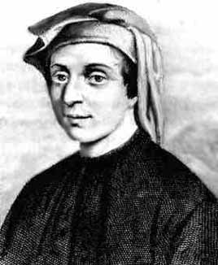
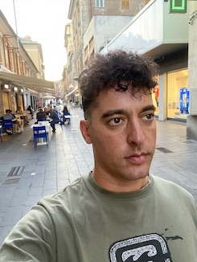

<!--
**fibo/fibo** is a ✨ _special_ ✨ repository because its `README.md` (this file) appears on your GitHub profile.

Here are some ideas to get you started:

- 🔭 I’m currently working on ...
- 🌱 I’m currently learning ...
- 👯 I’m looking to collaborate on ...
- 🤔 I’m looking for help with ...
- 💬 Ask me about ...
- 📫 How to reach me: ...
- 😄 Pronouns: ...
-->

## ⚡ Fun fact

> I am Fibonacci's reincarnation

When I was four years old I knew by heart the multiplication table from 1 to 10. When I discovered that it is also possible to go further with number 11 I was really excited and figured out by my self the multiplication table for number 12 which was my favourite one.

I always felt passionate about *Mathematics* the **Queen of Science**, in particular *Geometry* and *Number Theory*.

Many years later I realized this coincidence, as you can see in the photos below I look similar to Fibonacci.

Even if I joined the *Pythagorean community* in Crotone, nowadays I have no issue eating beans.

 

By the way, the famous *Fibonacci sequence* was introduced in his book *Liber Abaci* just as an excercise and it comes from Indian Mathematics. Actually, the most brilliant result of Fibonacci was to import Arabic numbers to Europe, otherwise my cell number would be *III IV IX VI I IV IX I VI* ... ehm last digit is 0 so I cannot write it down as Roman number.
